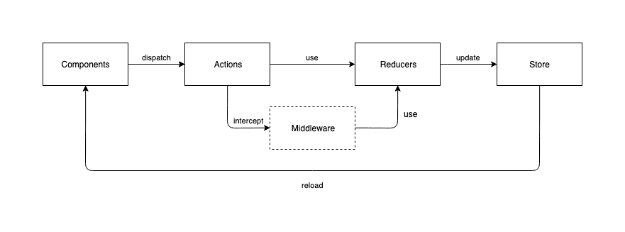

# Redux - Single Source of Truth

[Ultimate Redux guide for Flutter](https://brainsandbeards.com/blog/ultimate-redux-guide-for-flutter)

Redux is a predictable state container for Dart and Flutter apps. Redux for Dart using generics for typed State. It includes a rich ecosystem of Docs, Middleware, Dev Tools and can be combined with Flutter using the flutter_redux package

1. Single Source of Truth
2. State is Immutable
3. Pre functions change the state

# What is Redux?
It uses a unidirectional data flow model to create an immutable data stream and follows the logic of asynchronous and reactive programming. It means there’s a single source of truth (called store) which provides the information across your whole application and keeps the data globally accessible. With every modification in the store, a completely new application state is generated and passed to the subscribed components. This way we can make the data immutable between refresh cycles and avoid inconsistent states.

## Components
UI elements presenting data on the screen and initiating changes of the application’s state by responding to user interactions.

## Actions
Actions carry the information in their payload and pass it to reducers. 

## Reducer
Reducers receive the information through actions and implement the business logic layer to handle data and generate the next state of the application.

## Middleware
Middleware adds more layers to your application by intercepting the actions before they reach the reducers and do additional data processing.

## Store
The store represents the current global state of your application. It can only be changed by the reducers and when it happens the components which are observing particular values in the store will be automatically notified.

