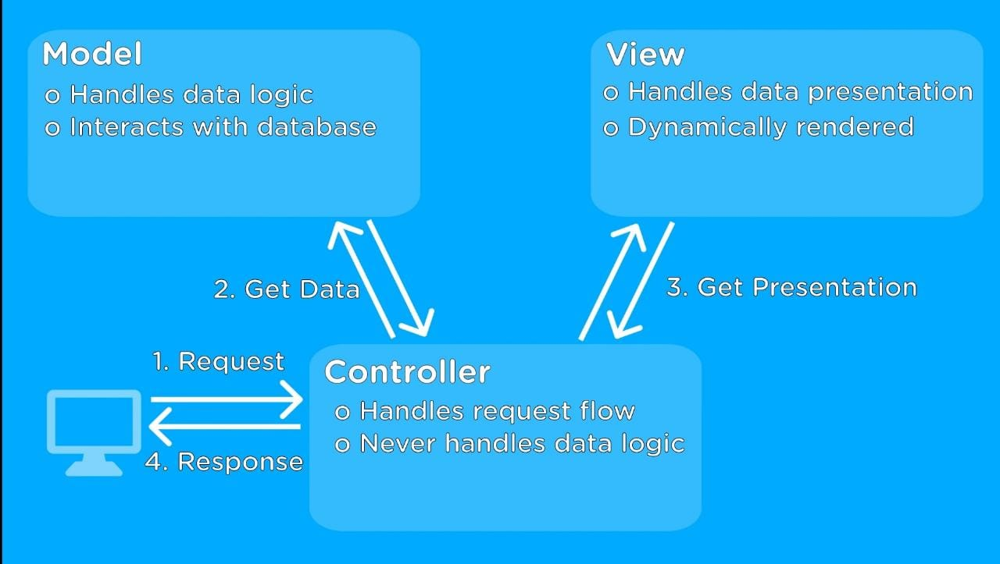

# Model View Controller

MVC (Model-View-Controller) is a pattern in software design commonly used to implement user interfaces, data, and controlling logic. It emphasizes a separation between the software's business logic and display. This "separation of concerns" provides for a better division of labor and improved maintenance

1. Model = Represent your data in your code(Data Model) & Works with your data (Save,Fetch)
2. Views = What the users sees, Decoupled from your application code
3. Controller = Connecting your Models and your Views, Contains the "in-between" logic

## `Separation of Concerns`

## Model

- Responsible for representing your data
- Responsible for managing your data
- Contains data-related logic

## View

- What the users see
- Should not contain too much logic

## Controller

[ Split across Middleware functions ] - ROUTES

- Connecting Model and Views
- Should only make sure that the two can communicate (in both direction)

# Steps



1. Get Request from User in Controller through routes
2. Get Data using model from controller
3. Send data to presentation from controller

```js
/*
  NAME : PRODUCT MODEL
  PATH : /models/product.js
*/
const path = require("path");
const express = require("express");
const adminController = require("../controllers/admin");
const router = express.Router();

router.get("/add-product", adminController.getAddProduct);
router.get("/products", adminController.getProducts);
router.post("/add-product", adminController.postAddProduct);
module.exports = router;
```

# Model

```js
/*
  NAME : PRODUCT MODEL
  PATH : /models/product.js
*/
const fs = require("fs");
const path = require("path");

const p = path.join(
  path.dirname(process.mainModule.filename),
  "data",
  "products.json"
);

const getProductsFromFile = (cb) => {
  fs.readFile(p, (err, fileContent) => {
    if (err) {
      cb([]);
    } else {
      cb(JSON.parse(fileContent));
    }
  });
};

module.exports = class Product {
  constructor(title, imageUrl, description, price) {
    this.title = title;
    this.imageUrl = imageUrl;
    this.description = description;
    this.price = price;
  }

  save() {
    getProductsFromFile((products) => {
      products.push(this);
      fs.writeFile(p, JSON.stringify(products), (err) => {
        console.log(err);
      });
    });
  }

  static fetchAll(cb) {
    getProductsFromFile(cb);
  }
};
```

# View

```js
/*
  NAME : PRODUCT MODEL
  PATH : /views/shop/index.js
*/
<%- include('../includes/head.ejs') %>
    <link rel="stylesheet" href="/css/product.css">
</head>

<body>
    <%- include('../includes/navigation.ejs') %>

    <main>
        <% if (prods.length > 0) { %>
            <div class="grid">
                <% for (let product of prods) { %>
                    <article class="card product-item">
                        <header class="card__header">
                            <h1 class="product__title"><%= product.title %></h1>
                        </header>
                        <div class="card__image">
                            "
                                alt="<%= product.title %>">
                        </div>
                        <div class="card__content">
                            <h2 class="product__price">$<%= product.price %></h2>
                            <p class="product__description"><%= product.description %></p>
                        </div>
                        <div class="card__actions">
                            <button class="btn">Add to Cart</button>
                        </div>
                    </article>
                <% } %>
            </div>
        <% } else { %>
            <h1>No Products Found!</h1>
        <% } %>
    </main>
<%- include('../includes/end.ejs') %>
```

# Controller

```js
/*
  NAME : PRODUCT MODEL
  PATH : /controllers/shop.js
*/
const Product = require("../models/product");

exports.getProducts = (req, res, next) => {
  Product.fetchAll((products) => {
    res.render("shop/product-list", {
      prods: products,
      pageTitle: "All Products",
      path: "/products",
    });
  });
};

exports.getIndex = (req, res, next) => {
  Product.fetchAll((products) => {
    res.render("shop/index", {
      prods: products,
      pageTitle: "Shop",
      path: "/",
    });
  });
};

exports.getCart = (req, res, next) => {
  res.render("shop/cart", {
    path: "/cart",
    pageTitle: "Your Cart",
  });
};

exports.getOrders = (req, res, next) => {
  res.render("shop/orders", {
    path: "/orders",
    pageTitle: "Your Orders",
  });
};

exports.getCheckout = (req, res, next) => {
  res.render("shop/checkout", {
    path: "/checkout",
    pageTitle: "Checkout",
  });
};
```
