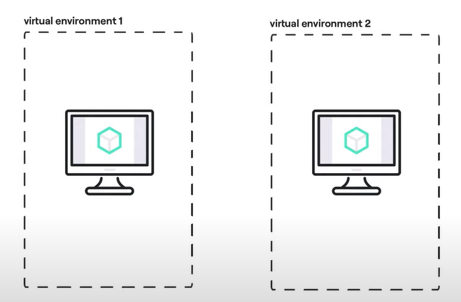
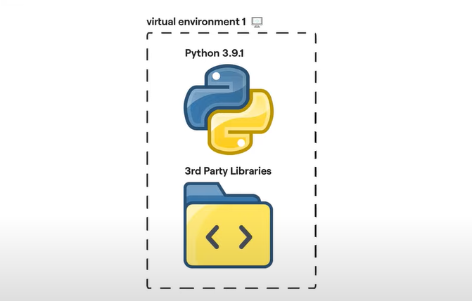

# Python Virtual Environments

A virtual environment is a Python environment such that the Python interpreter, libraries and scripts installed into it are isolated from those installed in other virtual environments, and (by default) any libraries installed in a “system” Python, i.e., one which is installed as part of your operating system.

# Virtual Environment

A virtual environment is a directory tree which contains Python executable files and other files which indicate that it is a virtual environment.

Common installation tools such as setuptools and pip work as expected with virtual environments. In other words, when a virtual environment is active, they install Python packages into the virtual environment without needing to be told to do so explicitly.


Every Virtual Environment has it own

- Python Vesrion
- 3rd Party Libraries



# VENV

```
CREATE VIRTUAL ENVIRONEMENT
python -m venv .venv

ACTIVATE VIRTUAL ENVIRONMENT
source pyvenv/bin/active  [LINUX]
pyvenv/Scripts/activate [WINDOW]

INSTALLING REQUIREMENTS
Activate VE
pip install -r requirments.txt

```

# Requirements

```txt
requirements-dev.txt
requirements.txt

flask==1.0.0
requests>=1.1.2,<2.0
qunicorn
```
